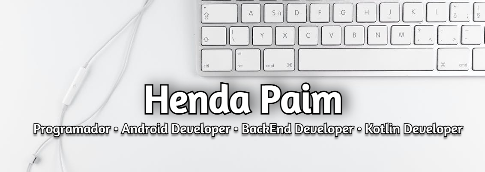

<!--

	

-->

<h1 align="center">Olá 👋, Eu sou Henda Paim</h1>
<!--<h3 align="center">Kotlin Developer | Android Developer</h3>-->

	

  

  

<!--
## ℹ️ Sobre mim / About Me

### `I'm a kotlin developer...`

#### Agora

- 🌱 Aprendendo tudo sobre **Desenvolvimento Android**

- 🔥 Interessado em **kotlin** e **Desenvolvimento Android**

- 📅 Procurando contribuir para projetos baseados em **kotlin** de **código aberto**

- 💬 Pergunta-me sobre **Kotlin, Android**

- 📫 Como chegar até mim **hendapaim@gmail.com**

- 📄 Por favor, dê uma olhada no meu <a href="#">**currículo**</a> para mais detalhes sobre mim.

#### Bio

- 🎓 Estou atualmente no último ano de graduação estudando Engenharia Electrónica e Telecomunicações na Universidade Agostinho Neto.

- 🔭 Atualmente estou trabalhando como estagiário do Google Summer of Code na GNOME Organization. 

- 🧠Tenho conhecimento em HTML, CSS, javaScript. Todavia **kotlin** é a minha linguagem principal, convido-te a ver os meus projectos maioritarimante usando a linguagem kotlin e tudo envolve a linguagem.

- 💡 Gosto de resolver problemas algorítmicos ou trabalhar no meu projeto paralelo durante meu tempo livre.

- 🌱 Estou no caminho certo me especializando em desenvolvimento android mais sobre Design de Sistemas, Kotlin.

- 💬 Sinta-se livre para me contactar para oportunidades de trabalho ou codar lado-a-lado em um projeto. -->

  
<!-- ### Blogs posts
<!-- BLOG-POST-LIST:START -->
<!-- BLOG-POST-LIST:END  -->

<!-- <h2 align="center"> </h2> -->
<h3 align="left">🔗 Conecte-se comigo:</h3> 

<!--  -->

